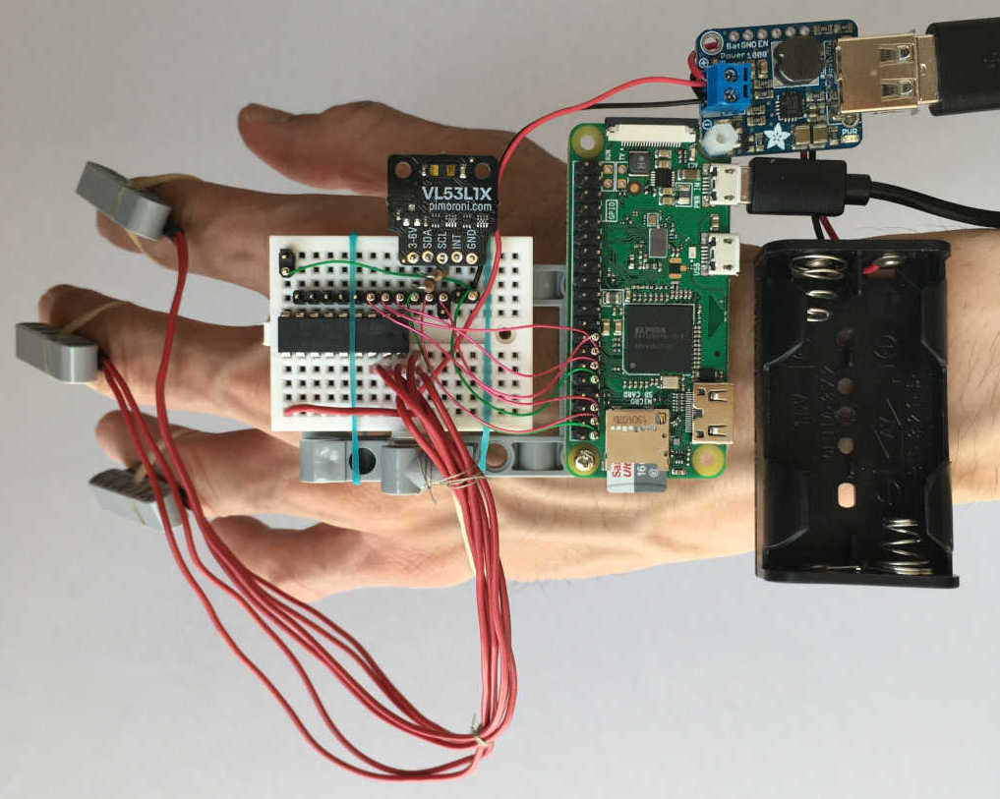
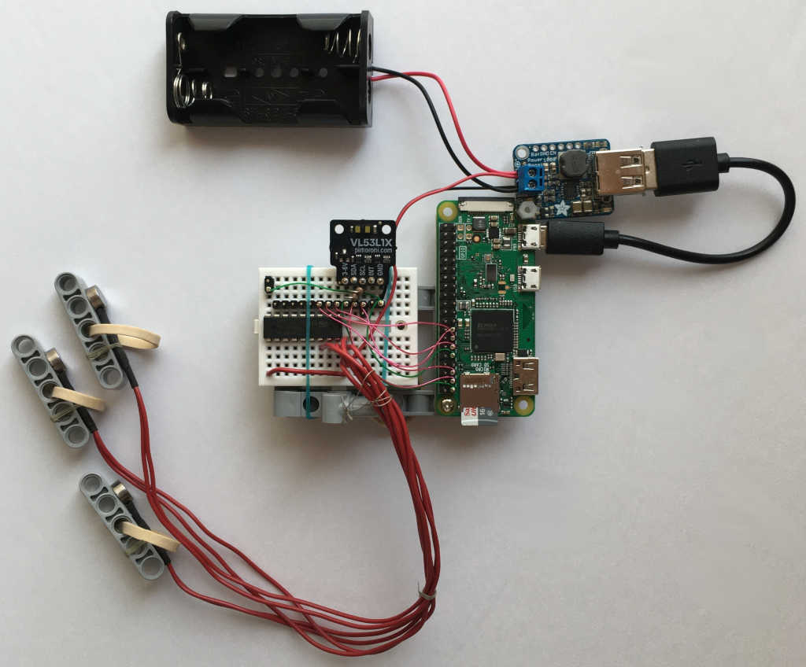
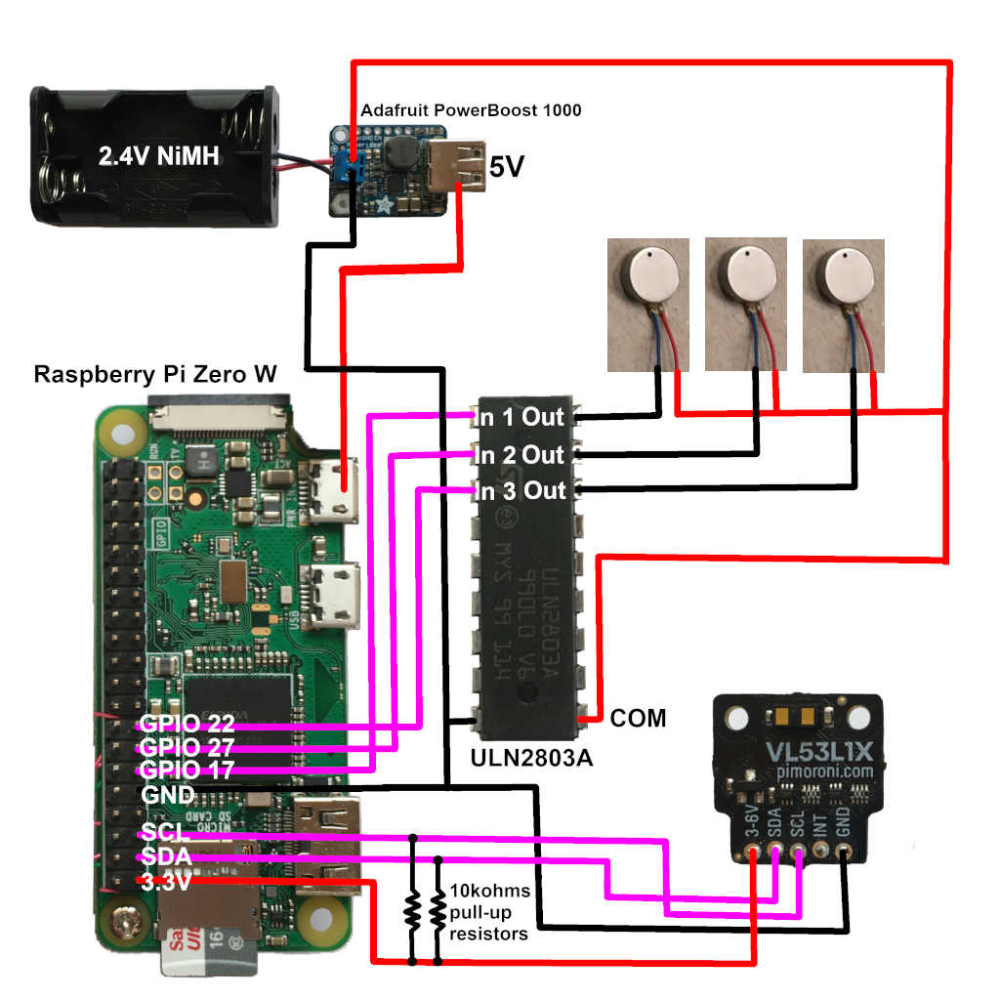

# Raspberry-Pi-Time-of-Flight-Haptics

A project inspired by Jacob Kilian's Unfolding Space glove which enables users to haptically sense 3D point clouds from depth camera. 

https://vimeo.com/363561643

This project explores using a Raspberry Pi to oscillate LRA motors with data from a Pimoroni VL53L1X Time of Flight sensor. 

## Hardware

Pi Zero W is used (models A+ and 3B+ work). For this project, it is a wearable device with a small single-core computer. 

Pi Zero uses 100mA and Pi Zero W, 150mA (verified): 

https://www.raspberrypi.org/documentation/hardware/raspberrypi/power/README.md

A Raspberry Pi Zero should work and could be used where longer battery life and no wireless connectivity are required. However, with Pi Zero W, one can ssh from another computer to apt-get and remote debugging. Pi Zero W has been used as a stand-alone wifi server for three.js vr and Oculus Quest (not this project). 

Pimoroni VL53L1X Time of Flight sensor breakout: 

The VL53L1X is a 3rd generation STMicroelectronics sensor that uses infrared light (940nm laser) to measure to 4 meters and a programmable region of interest (ROI). Instead of mechanically moving the sensor to measure distance of different areas, VL53L1X ROI electronically looks at different areas (4x4) to construct a low resolution depth map. 

Unlike the 3D camera in Unfolding Space glove, VL53L1X is an indoor sensor. This project is about experimentation. 

ULN2803A Eight Darlington transistors arrays: 

To keep thing simple, coils in LRA are driven with square waves generated by Raspberry Pi software PWM GPIO pins. The GPIO pins are NOT driving coils directly. A ULN2803A drives 8 ERA directly. It is one ERA short of the nine in Unfolding Space glove. Another ULN2803A can be added. 

ULN2803A has built-in clamp diodes to protect Pi from back EMF. ULN2803A switches on current through a coil to generate a magnetic field. Turning off a coil causes the magnetic field to collapse and generate a counter EMF. 

G0832029D Linear Resonant Actuator: 

This LRA was manufactured by Jinlong Machinery & Electronics. It is end-of-life and will no longer be available from Digikey once stock is depleted. Instead of getting nine motors with the same specifications, the author got varied LRA motors with resonance 175, 205, and 235Hz, and ERM motors to experiment with. 

LRA (linear resonant actuator) are like tuning forks that vibrate in a narrow range of frequency. They are mass-on-a-spring (or magnet-on-a-spring) driven by a magnetic coil. 

Note - operating voltage for G0832029D is 0.1 ~ 1.9VrmsAC sine wave. PWM from two unregulated NiMH AA ~2.4V works for the experiment. 

## Software

Raspberry Pi OS Lite (tested May 7, 2021 release) 

https://www.raspberrypi.org/software/operating-systems/

https://github.com/pimoroni/vl53l1x-python

sudo pip install smbus2 
sudo pip install vl53l1x 

(if pip or i2c-detect not on Pi OS Lite) 

sudo apt-get update 
sudo apt-get install python-pip 
sudo install i2c-tools 

pigpio library 

sudo apt-get update 
sudo apt-get install pigpio python-pigpio python3-pigpio 
man pigpiod (if want to read about it) 
sudo pigpiod (do this before "import pigpio" in python) 

Before linux shutdown, "sudo killall pigpiod" to close daemon. Otherwise, shutdown is 90 seconds longer (write a script to handle).  

sudo killall pigpiod 
sudo shutdown now 

## References

Unfolding Space Glove: 

https://unfoldingspace.jakobkilian.de/

https://vimeo.com/363561643

Pi Zero W: 

https://www.raspberrypi.org/

https://www.raspberrypi.org/documentation/usage/gpio/

pigpio library: 

http://abyz.me.uk/rpi/pigpio/

VL53L1X laser-ranging sensor: 

https://www.st.com/en/imaging-and-photonics-solutions/vl53l1x.html

AN5191 Using the programmable region of interest (ROI): 

https://www.st.com/resource/en/application_note/dm00516219-using-the-programmable-region-of-interest-roi-with-the-vl53l1x-stmicroelectronics.pdf

https://shop.pimoroni.com/products/vl53l1x-breakout

https://github.com/pimoroni/vl53l1x-python

https://github.com/pimoroni/vl53l1x-python/blob/master/examples/roi.py

ULA2803A: 

https://www.st.com/content/ccc/resource/technical/document/datasheet/e4/fa/1c/16/4e/39/49/04/CD00000179.pdf/files/CD00000179.pdf/jcr:content/translations/en.CD00000179.pdf

G0832029D Linear Resonant Actuator: 

https://www.digikey.ca/en/products/detail/jinlong-machinery-electronics-inc/G0832029D/12323588
